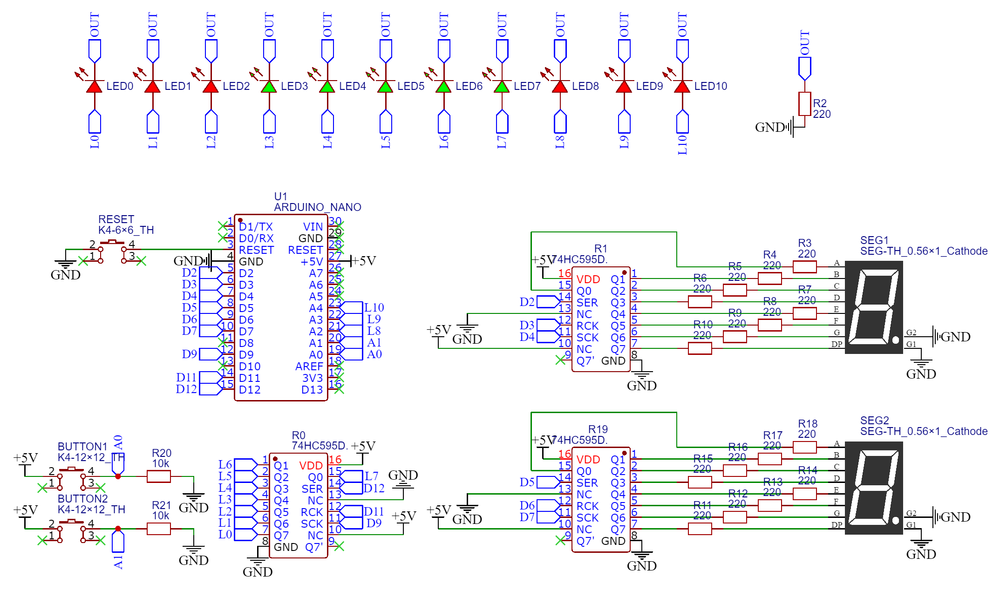
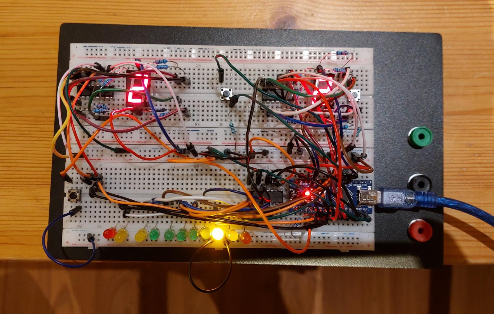
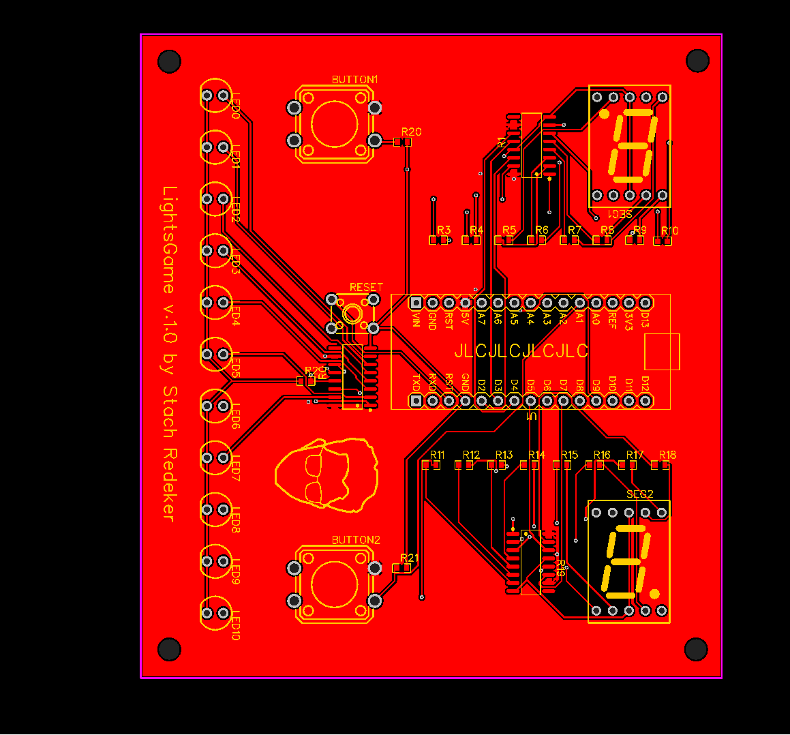
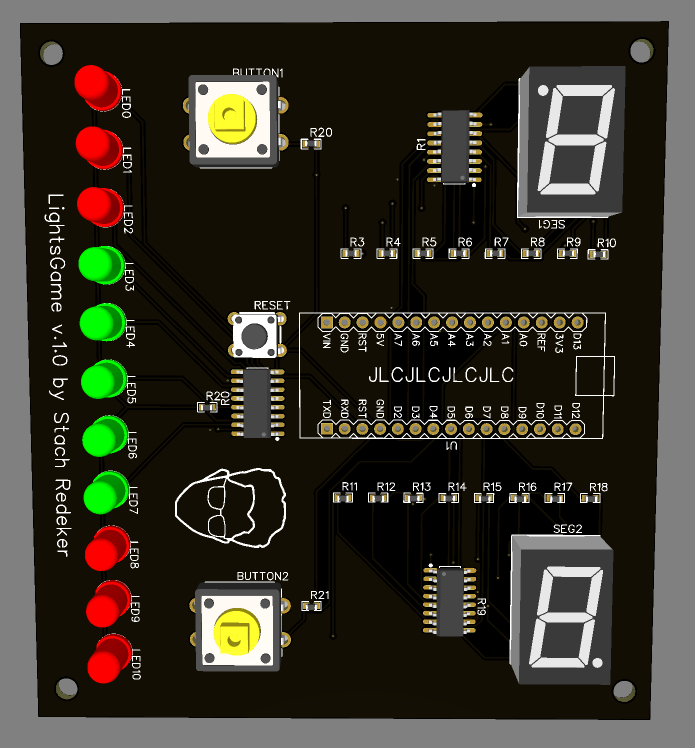
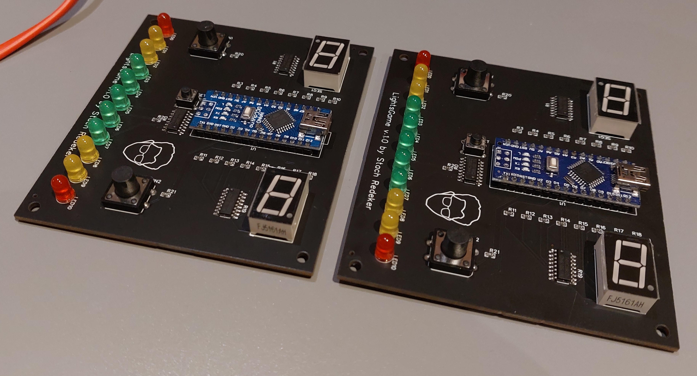

# LightsGame
> A modern version of a classic (1972) game: 1D pong. But, most importantly: my first PCB!

As a second year Electrical Engineering student, I wanted to do a project that would show of various skills that I learned during my studies. One of the skills is PCB design, for which I followed an extracurricular course. I also wanted to use the seven segment displays that I have never worked with before. Because at the moment, those were collecting dust in my drawers.

My first thought was to make a [stack calculator](https://orkhanhuseyn.medium.com/what-are-stack-based-calculators-cf2dbe249264). Those stack calculators are interesting devices that are no longer sold, and... also very lame. Then, perhaps subliminally influenced by the latest [Mark Rober video](https://www.youtube.com/watch?v=Rsxao9ptdmI), the idea of making my own arcade game came up.

My own arcade game. Sounds awesome! The plan was to make a 1D replica of the good old Pong game by Atari. You know right, that [tennis game](https://www.ponggame.org/) where you score a point if the other player is unable to return the ball before it hits the back wall?

### LightsGame features
- Fun game for one or two players
- Autoplay mode & win animation
- Custom design centered around an Arduino Nano
- Open source hardware and software
- Total costs: ~15 euros per board


## Electric circuit design

Everything starts with a ciruit. The brain of the operation is an Arduino Nano. I used shift registers to expand the number of outputs that the Arduino has.

### Schematic



### Breadboard realisation

Afterwards, I made a fully working breadboard realization. 



## PCB design

And then it was time for the PCB design. I made plenty of mistakes. The biggest one might be that I used the same width for power and signal traces. Also, during the circuit design phase, I was lazy and used only one current limiting resistor for all the red, yellow, and green LEDs. I should have gone back and implemented an individual resistor per LED, because that would make the system more robust. 

  


## Updating the shift registers

I wrote the following function to update the shift registers:

``` C++
// FUNCTION FOR TURING ON/OFF A SPECIFIC LED //
void LEDcontrol (int LED_n, int LED_status) {
  if (LED_n >= 0 && LED_n <= 7) { // if a LED is part of the shift register
    if (LED_status == 1) { // and the wanted status is on (1)
      bitSet(leds, LED_n); // set the n-th bit in the led byte to 1
      updateLEDs(); // and reset the shift register via the function updateLEDs()
    }
    if (LED_status == 0) { // and the wanted status is off (0)
      bitClear(leds, LED_n); // set the n-th bit in the led byte to 0
      updateLEDs(); // , , ,
    }
  }
  // LEDs that are not being controlled by the shift register are being controlled manually via digitalWrite()
  else if (LED_n == 8) {
    digitalWrite(LED8, LED_status);
  }
  else if (LED_n == 9) {
    digitalWrite(LED9, LED_status);
  }
  else if (LED_n == 10) {
    digitalWrite(LED10, LED_status);
  }
}
```

with a subfunction:

``` C++
// FUNCTION FOR UPDATING THE SHIFT REGISTER CONTROLLING THE LEDS//
void updateLEDs() {
   digitalWrite(latchPin1, LOW);
   shiftOut(dataPin1, clockPin1, LSBFIRST, leds);
   digitalWrite(latchPin1, HIGH);
}
```

`LEDcontrol()` takes as input the number of the LED that we want to control, and its requested status (`1` for on, `0` for off). If the LED number is `8`, `9`, or `10`, then changing the LED is easy. These LEDs are controlled by the Arduino itself. We can hence simply use `digitalWrite()` to change the LED status.

For LED numbers `<8`, it is more challenging. These LEDs are controlled by the shift register. For this, we alter a certain byte (array of 8 bits), `leds`, using the `bitSet()` instruction. This instruction sets the asked bit in the byte to whatever value (0/1) we specify. Afterwards, we call the subfunction `updateLEDs()` which sends the new byte to the shift register. 


## Final product



## Plans for improvements?
Currently, I have no plans for releasing a version 2. I am not planning on making this a commercially available product, scince LightsGame was solely designed as a fun weekend project. That being said, this project is fully open source. Feel free to make your own adaptations! If you like hardware design, extend the game to two dimensions. If you like software design, program your own gamemodes. And if you like industrial design, make an amazing 3D case for the PCB. Or heck, do it all!

The following improvements can be made:
- [ ] Assigning individual resistors to the LEDs in order to increase robustness.
- [ ] Using thicker PCB traces for power lines.
- [ ] Adding the yellow LEDs to the PCB (instead of just using red LEDs).
- [ ] Replacing the Arduino Nano by a programmable Atmega 328p SMD chip.

## Licence
[MIT](/LICENSE)

## Acknowledgements
[A useful quide on how to use shift registers.](https://docs.arduino.cc/tutorials/communication/guide-to-shift-out)

[GreatScott! has built something similar (of course he has). His version is bigger and works differently.](https://www.youtube.com/watch?v=liZMwInWuTM)

